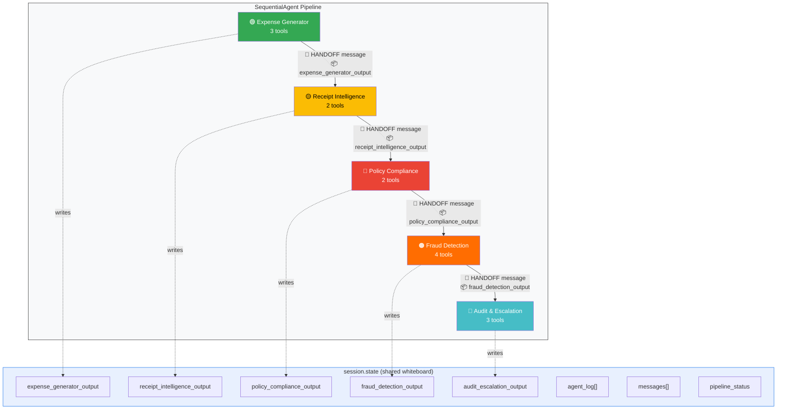
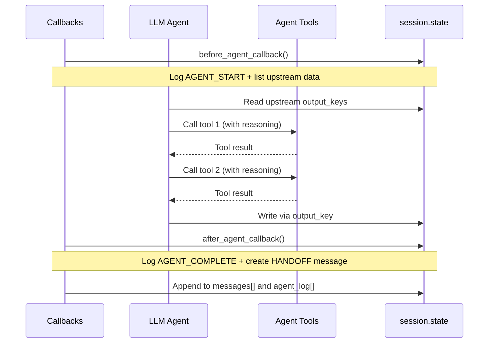
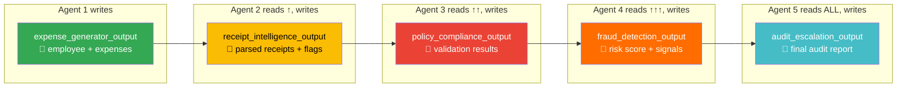

# ConcurShield AI — Technical Documentation

## Table of Contents

1. [Overview](#overview)
2. [Architecture](#architecture)
3. [Agent Specifications](#agent-specifications)
4. [Inter-Agent Communication Protocol](#inter-agent-communication-protocol)
5. [Data Models & Schemas](#data-models--schemas)
6. [Tools Reference](#tools-reference)
7. [Policy Engine](#policy-engine)
8. [Risk Scoring Algorithm](#risk-scoring-algorithm)
9. [Setup & Configuration](#setup--configuration)
10. [API Reference](#api-reference)
11. [Testing](#testing)

---

## 1. Overview

ConcurShield AI is a multi-agent expense intelligence simulator built on **Google ADK** (Agent Development Kit) with **Vertex AI Gemini 2.5 Flash**. It consists of 5 specialized AI agents that communicate through structured messages and shared session state to simulate the complete expense management lifecycle.

### Key Metrics

| Metric | Value |
|--------|-------|
| Total agents | 5 (LLM-based) + 1 orchestrator pipeline |
| Total tools | 14 functions |
| Shared schemas | 7 TypedDict models |
| Supported regions | 5 (US, DE, IN, UK, SG) |
| Vendor categories | 9 classifications |
| Risk score range | 0–100 (weighted) |
| Decision tiers | 2 (APPROVED, REJECTED) |

---

## 2. Architecture

### Pipeline Flow


### Inter-Agent Communication Flow



### Agent Lifecycle (per agent)



### System Components

```
concur_shield/
├── __init__.py                 # Package init, re-exports root_agent
├── agent.py                    # Root Orchestrator + SequentialAgent pipeline
│
├── shared/
│   ├── schemas.py              # 7 TypedDict data models (shared contracts)
│   ├── utils.py                # ID generators, date helpers, 6 data pools
│   └── protocols.py            # Inter-agent protocol, callbacks, message passing
│
└── agents/
    ├── expense_generator/      # Agent 1: 3 tools (profile, report, anomaly)
    │   ├── agent.py            #   output_key → expense_generator_output
    │   └── tools.py
    ├── receipt_intelligence/    # Agent 2: 2 tools (parse, enrich)
    │   ├── agent.py            #   output_key → receipt_intelligence_output
    │   └── tools.py
    ├── policy_compliance/      # Agent 3: 2 tools (policy, validate)
    │   ├── agent.py            #   output_key → policy_compliance_output
    │   └── tools.py
    ├── fraud_detection/        # Agent 4: 4 tools (duplicate, velocity, vendor, score)
    │   ├── agent.py            #   output_key → fraud_detection_output
    │   └── tools.py
    └── audit_escalation/       # Agent 5: 3 tools (consolidate, decide, report)
        ├── agent.py            #   output_key → audit_escalation_output
        └── tools.py
```

### Execution Model

The pipeline uses Google ADK's `SequentialAgent`, which executes sub-agents one after another. Each agent:

1. **Receives** a `before_agent_callback` — logs entry, lists available upstream state
2. **Processes** — LLM reasons over instructions, calls tools, generates output
3. **Writes** output to `session.state[output_key]` automatically via ADK
4. **Receives** an `after_agent_callback` — logs completion, creates HANDOFF message
5. **Yields** control to the next agent in the pipeline

### State Data Flow



---

## 3. Agent Specifications

### Agent 1: Expense Generator

| Property | Value |
|----------|-------|
| Name | `expense_generator` |
| Model | `gemini-2.5-flash` |
| Output Key | `expense_generator_output` |
| Tools | `generate_employee_profile`, `generate_expense_report`, `inject_anomaly` |
| Callbacks | before_agent_callback, after_agent_callback |

**Responsibilities**:
- Generate synthetic employee profiles (16 names, 10 departments, 10 grades)
- Create expense reports with 1-10 line items across 7 categories
- Optionally inject anomalies: `duplicate`, `inflated`, `out_of_policy`, `weekend_claim`

**Data Pools**:
- Vendors: 40+ across 7 categories (Flight, Hotel, Meal, Taxi, Mileage, Per Diem, Misc)
- Cities: 20 global cities (15 US/domestic, 5 international)
- Currency multipliers: USD (1.0), EUR (0.92), INR (83.0), GBP (0.79), SGD (1.34)

---

### Agent 2: Receipt Intelligence

| Property | Value |
|----------|-------|
| Name | `receipt_intelligence` |
| Model | `gemini-2.5-flash` |
| Output Key | `receipt_intelligence_output` |
| Tools | `parse_receipt`, `enrich_receipt_metadata` |
| Callbacks | before_agent_callback, after_agent_callback |

**Vendor Classification**:

| Category | MCC Code | Example Vendors |
|----------|----------|-----------------|
| Restaurant | MCC-5812 | Capital Grille, Chipotle, Starbucks |
| Hotel | MCC-7011 | Marriott, Hilton, Hyatt |
| Airline | MCC-4511 | United, Delta, Lufthansa |
| Transport | MCC-4121 | Uber, Lyft, Yellow Cab |
| Entertainment | MCC-7941 | Spa, Wellness centers |
| Retail | MCC-5999 | Amazon, Best Buy |
| Office | MCC-5943 | FedEx, Staples |
| Fuel | MCC-5541 | Gas stations |
| Other | MCC-0000 | Unclassified |

**Enrichment Flags**:
- `WEEKEND_TRANSACTION` — expense date falls on Saturday/Sunday
- `HIGH_VALUE_TRANSACTION` — amount > $500
- `VERY_HIGH_VALUE` — amount > $1,000
- `NON_BUSINESS_CATEGORY` — vendor classified as Entertainment
- `UNCLASSIFIED_VENDOR` — vendor could not be classified
- `INTERNATIONAL_TRANSACTION` — city is Munich, London, Bangalore, Singapore, or Tokyo

---

### Agent 3: Policy Compliance

| Property | Value |
|----------|-------|
| Name | `policy_compliance` |
| Model | `gemini-2.5-flash` |
| Output Key | `policy_compliance_output` |
| Tools | `get_expense_policy`, `validate_expense` |
| Callbacks | before_agent_callback, after_agent_callback |

**Validation Rules** (executed per expense):

| # | Rule | Condition | Result |
|---|------|-----------|--------|
| 1 | Amount Limit | `amount > category_limit` | Violation |
| 2 | Weekend Claim | `is_weekend AND !weekend_claims_allowed` | Violation |
| 3 | Restricted Category | `vendor_category == "Entertainment" AND !entertainment_allowed` | Violation |
| 4 | Suspicious Vendor | Vendor name contains: spa, wellness, personal, gift, liquor, bar | Violation |
| 5 | Receipt Threshold | `amount > require_receipt_above` | Informational |

**Status Determination**:
- 0 violations → `APPROVED`
- 1 violation → `NEEDS_REVIEW`
- 2+ violations → `REJECTED`

---

### Agent 4: Fraud Detection

| Property | Value |
|----------|-------|
| Name | `fraud_detection` |
| Model | `gemini-2.5-flash` |
| Output Key | `fraud_detection_output` |
| Tools | `detect_duplicate_claims`, `analyze_submission_velocity`, `check_vendor_patterns`, `compute_risk_score` |
| Callbacks | before_agent_callback, after_agent_callback |

**Detection Methods**:

1. **Duplicate Claims**: Scans for:
   - Same receipt number appearing multiple times (`severity: HIGH`)
   - Identical amount + vendor + date across different expense IDs (`severity: CRITICAL`)

2. **Submission Velocity**: Flags:
   - 4+ expenses submitted on the same date (`severity: MEDIUM`)
   - All expenses concentrated in ≤2 days when total > 5 (`severity: LOW`)

3. **Vendor Patterns**: Identifies:
   - Vendor appearing 3+ times — possible favoritism (`severity: MEDIUM`)
   - Non-business keywords in vendor name (`severity: HIGH`)

---

### Agent 5: Audit & Escalation

| Property | Value |
|----------|-------|
| Name | `audit_escalation` |
| Model | `gemini-2.5-flash` |
| Output Key | `audit_escalation_output` |
| Tools | `consolidate_findings`, `make_audit_decision`, `generate_audit_report` |
| Callbacks | before_agent_callback, after_agent_callback |

**Decision Matrix**:

| Condition | Decision | Key Actions |
|-----------|----------|-------------|
| Condition | Decision | Key Actions |
|-----------|----------|-------------|
| `risk_score ≥ 50` OR `rejected ≥ 1` OR `signals ≥ 2` OR `needs_review ≥ 2` | REJECTED | Rejected due to risk/compliance issues, payment suspended |
| All else | APPROVED | Approved, process reimbursement |

---

## 4. Inter-Agent Communication Protocol

### Message Format

```python
{
    "timestamp": "2026-02-12T00:30:00.000000Z",
    "sender": "expense_generator",
    "receiver": "receipt_intelligence",
    "message_type": "HANDOFF",           # HANDOFF | DATA | ALERT | DECISION
    "payload": {
        "status": "completed",
        "output_location": "state['expense_generator_output']"
    },
    "reasoning": "Agent expense_generator has completed. Data available for receipt_intelligence."
}
```

### Lifecycle Events (agent_log)

```python
# AGENT_START event
{
    "timestamp": "2026-02-12T00:30:00Z",
    "event": "AGENT_START",
    "agent": "policy_compliance",
    "message": "🚀 [policy_compliance] Starting processing...",
    "upstream_data_available": ["expense_generator_output", "receipt_intelligence_output"]
}

# AGENT_COMPLETE event
{
    "timestamp": "2026-02-12T00:30:05Z",
    "event": "AGENT_COMPLETE",
    "agent": "policy_compliance",
    "message": "✅ [policy_compliance] Completed. Handing off to → fraud_detection",
    "data_produced": "output_key: policy_compliance_output"
}
```

### Pipeline Status

```python
{
    "started_at": "2026-02-12T00:30:00Z",
    "current_agent": "fraud_detection",
    "agents_completed": ["expense_generator", "receipt_intelligence", "policy_compliance"],
    "completed_at": null  # set when pipeline finishes
}
```

---

## 5. Data Models & Schemas

All schemas are defined in `concur_shield/shared/schemas.py` as `TypedDict` classes:

| Schema | Fields | Used By |
|--------|--------|---------|
| `EmployeeProfile` | employee_id, name, email, department, grade, region, cost_center, manager, risk_tier | Agent 1 → All |
| `ExpenseItem` | expense_id, employee_id, category, subcategory, amount, currency, date, vendor, city, description, receipt_number, is_weekend, is_anomaly, anomaly_type | Agent 1 → All |
| `ReceiptData` | expense_id, vendor_name, vendor_category, merchant_code, transaction_date, amount, currency, payment_method, city, is_weekend, confidence_score | Agent 2 → 3,4,5 |
| `PolicyResult` | expense_id, status, violations, applicable_limit, actual_amount, policy_region, rule_applied | Agent 3 → 4,5 |
| `FraudSignal` | signal_type, severity, description, affected_expense_ids, confidence | Agent 4 → 5 |
| `FraudResult` | employee_id, risk_score, risk_level, signals, recommendation | Agent 4 → 5 |
| `AuditDecision` | employee_id, report_id, decision, total_amount, total_items, policy_violations, fraud_risk_score, fraud_signals_count, summary, action_items, processed_at | Agent 5 → User |

---

## 6. Tools Reference

### Agent 1 Tools

#### `generate_employee_profile(region, department, risk_tier) → dict`
Creates a synthetic employee. Randomizes from pools of 16 names, 10 departments, 10 grades, 5 managers.

#### `generate_expense_report(employee_id, employee_name, region, num_items, include_anomalies, trip_purpose) → dict`
Generates 1-10 expense items. Categories: Flight ($200-1500), Hotel ($120-450), Meal ($15-95), Taxi ($10-75), Per Diem ($50-100), Mileage ($20-150), Misc ($5-200). Amounts scaled by currency multiplier.

#### `inject_anomaly(expense_id, employee_id, category, amount, currency, date, vendor, anomaly_type) → list`
Injects specific anomaly: `duplicate` (clones item), `inflated` (2.5x amount), `split_expense` (splits into two), `weekend_claim` (forces weekend date).

### Agent 2 Tools

#### `parse_receipt(expense_id, vendor, amount, currency, date, category, city) → dict`
Classifies vendor via keyword matching (50+ patterns). Assigns MCC codes. Confidence: 0.85-0.99 for known vendors, 0.60-0.82 for unknown.

#### `enrich_receipt_metadata(expense_id, vendor_name, vendor_category, amount, city, is_weekend) → dict`
Adds flags: WEEKEND, HIGH_VALUE, VERY_HIGH_VALUE, NON_BUSINESS, UNCLASSIFIED, INTERNATIONAL. Returns `requires_additional_review` if 2+ flags.

### Agent 3 Tools

#### `get_expense_policy(region) → dict`
Returns full policy config for region. Includes: meal/hotel/flight/taxi/per_diem/mileage/misc limits, weekend/entertainment rules, receipt thresholds, max daily total.

#### `validate_expense(expense_id, category, amount, currency, date, vendor, is_weekend, region, vendor_category) → dict`
Runs 5 validation checks. Returns status (APPROVED/NEEDS_REVIEW/REJECTED), violations list, applicable limit, and actual amount.

### Agent 4 Tools

#### `detect_duplicate_claims(expense_ids, receipt_numbers, amounts, vendors, dates) → dict`
Cross-checks all expenses for duplicate receipt numbers and identical amount+vendor+date combinations.

#### `analyze_submission_velocity(employee_id, expense_dates, expense_ids) → dict`
Checks for 4+ expenses on same day, or all expenses concentrated in ≤2 days.

#### `check_vendor_patterns(vendors, amounts, expense_ids) → dict`
Detects vendor appearing 3+ times, or vendor names containing suspicious keywords.

#### `compute_risk_score(employee_id, total_amount, num_expenses, duplicate_signals, velocity_signals, vendor_signals, policy_violations, weekend_claims) → dict`
Weighted aggregation: duplicates(×20, max 40) + violations(×10, max 25) + vendors(×8, max 15) + velocity(×5, max 10) + weekends(×5, max 10) + amount bonuses. Capped at 100.

### Agent 5 Tools

#### `consolidate_findings(employee_id, employee_name, ..., fraud_risk_score, fraud_signals) → dict`
Merges all upstream data into unified view with compliance rate and overall health assessment.

#### `make_audit_decision(employee_id, ..., fraud_risk_score, total_fraud_signals) → dict`
Applies decision matrix. Returns decision + numbered action items with emojis.

#### `generate_audit_report(employee_id, ..., action_items) → dict`
Produces final structured audit report with header, employee info, financial summary, risk assessment, policy compliance, and decision details.

---

## 7. Policy Engine

### Regional Policies

| Policy | 🇺🇸 US (USD) | 🇩🇪 DE (EUR) | 🇮🇳 IN (INR) | 🇬🇧 UK (GBP) | 🇸🇬 SG (SGD) |
|--------|-----------|-----------|------------|-----------|-----------|
| Meal Limit | 75 | 60 | 3,500 | 60 | 100 |
| Hotel Limit | 350 | 250 | 12,000 | 280 | 450 |
| Flight (Domestic) | 800 | 600 | 25,000 | 500 | 400 |
| Flight (Int'l) | 2,500 | 2,000 | 100,000 | 2,000 | 3,000 |
| Taxi Limit | 100 | 80 | 3,000 | 80 | 120 |
| Per Diem | 75 | 60 | 3,500 | 60 | 100 |
| Mileage Rate/mi | 0.67 | 0.30 | 12.00 | 0.45 | 0.70 |
| Mileage Cap | 200 | 150 | 5,000 | 150 | 200 |
| Misc Limit | 150 | 100 | 5,000 | 120 | 180 |
| Max Daily Total | 600 | 500 | 25,000 | 450 | 700 |
| Receipt Required > | 25 | 20 | 500 | 20 | 30 |
| Weekend Claims | ❌ | ❌ | ❌ | ❌ | ❌ |
| Entertainment | ❌ | ❌ | ❌ | ❌ | ❌ |

---

## 8. Risk Scoring Algorithm

### Formula

```
RiskScore = min(100,
    min(duplicate_signals × 20, 40) +
    min(policy_violations × 10, 25) +
    min(vendor_signals × 8, 15) +
    min(velocity_signals × 5, 10) +
    min(weekend_claims × 5, 10) +
    (5 if total_amount > 5000) +
    (5 if total_amount > 10000)
)
```

### Signal Severity Classification

| Signal Type | Severities |
|-------------|-----------|
| Duplicate receipt | HIGH |
| Identical amount+vendor+date | CRITICAL |
| 4+ expenses/day | MEDIUM |
| Batch fabrication pattern | LOW |
| Vendor favoritism (3+ uses) | MEDIUM |
| Non-business vendor name | HIGH |

---

## 9. Setup & Configuration

### Environment Variables

```env
# Required: Choose ONE authentication method

# Option A: Vertex AI (recommended for enterprise)
GOOGLE_CLOUD_PROJECT=your-project-id
GOOGLE_CLOUD_LOCATION=us-central1
GOOGLE_GENAI_USE_VERTEXAI=TRUE

# Option B: Google AI Studio (simpler)
GOOGLE_API_KEY=your-api-key
```

### Running

```bash
# Install dependencies
pip3 install google-adk

# Interactive CLI
adk run concur_shield

# Web UI (port 8000)
adk web concur_shield
```

---

## 10. API Reference

### ADK Features Used

| ADK Feature | Usage |
|-------------|-------|
| `Agent` (LlmAgent) | All 5 sub-agents with `gemini-2.5-flash` |
| `SequentialAgent` | Pipeline orchestration |
| `output_key` | State chaining between agents |
| `before_agent_callback` | Entry logging, state initialization |
| `after_agent_callback` | Completion logging, handoff messages |
| `session.state` | Shared communication whiteboard |
| `tools` | 14 Python functions as agent tools |

### Session State Keys

| Key | Type | Written By |
|-----|------|-----------|
| `pipeline_status` | dict | Callbacks |
| `agent_log` | list[dict] | Callbacks |
| `messages` | list[dict] | Callbacks |
| `expense_generator_output` | str | Agent 1 |
| `receipt_intelligence_output` | str | Agent 2 |
| `policy_compliance_output` | str | Agent 3 |
| `fraud_detection_output` | str | Agent 4 |
| `audit_escalation_output` | str | Agent 5 |

---

## 11. Testing

### Import Verification

```bash
python3 -c "from concur_shield.agent import root_agent; print(root_agent.name)"
# Expected: concur_shield_ai
```

### Agent Verification

```bash
python3 -c "
from concur_shield.agent import expense_pipeline
for a in expense_pipeline.sub_agents:
    print(f'{a.name}: output_key={a.output_key}, callbacks=✓')
"
```

### End-to-End Tool Test

```bash
python3 -c "
from concur_shield.agents.expense_generator.tools import generate_employee_profile, generate_expense_report
profile = generate_employee_profile('US')
report = generate_expense_report(profile['employee_id'], profile['name'], num_items=5, include_anomalies=True)
print(f'Generated {report[\"total_items\"]} items, \${report[\"total_amount\"]}')
"
```

### ADK Web UI Test

```bash
adk web concur_shield
# Open http://localhost:8000
# Try: "Generate a synthetic expense report with fraud patterns"
```

---

*ConcurShield AI v1.0 — Technical Documentation*
*Built with Google ADK · Vertex AI · Python 3.13*
